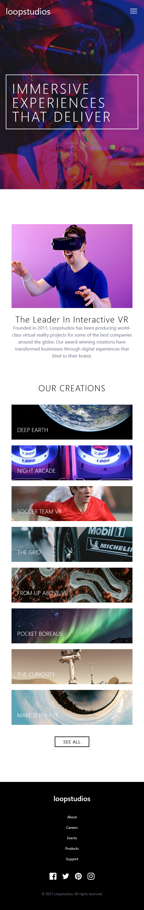

# Frontend Mentor - Loopstudios landing page solution

This is a solution to the [Loopstudios landing page challenge on Frontend Mentor](https://www.frontendmentor.io/challenges/loopstudios-landing-page-N88J5Onjw). Frontend Mentor challenges help you improve your coding skills by building realistic projects. 

## Table of contents

- [Overview](#overview)
  - [The challenge](#the-challenge)
  - [Screenshot](#screenshot)
  - [Links](#links)
- [My process](#my-process)
  - [Built with](#built-with)
  - [What I learned](#what-i-learned)
  - [Continued development](#continued-development)
  - [Useful resources](#useful-resources)
- [Author](#author)
- [Acknowledgments](#acknowledgments)

## Overview

### The challenge

Users should be able to:

- View the optimal layout for the site depending on their device's screen size
- See hover states for all interactive elements on the page

### Screenshot

## Mobile Layout


## Desktop Layout


### Links

- Live Site URL: [Vercel](https://loop-studios-landing-page-kohl.vercel.app/)

## My process

### Built with

- Semantic HTML5 markup
- Tailwind CSS
- Flexbox
- CSS Grid
- Mobile-first workflow
- Vite
- [React](https://reactjs.org/) - JS library

### What I learned

```jsx
<div className="[ xl:hidden xl:aria-hidden ] [ min-h-full ]">
```
```css
@theme {
  --font-josefinSans: Josefin Sans, sans-serif;
  --animate-fade-in-textBox: fade-in 4s;
  --animate-fade-in-dropDownMenu: fade-in .5s ease-in;
  --animate-fade-out-dropDownMenu: fade-out .5s ease-out;
  --animate-fade-in-about: fade-in 2s ease-in;
  --animate-fade-in-careers: fade-in 3s ease-in;
  --animate-fade-in-events: fade-in 4s ease-in;
  --animate-fade-in-products: fade-in 5s ease-in;
  --animate-fade-in-support: fade-in 6s ease-in;

  @keyframes fade-in {
      0% {
          opacity: 0;
      }
      100% {
          opacity: 1;
      }
  }

  @keyframes fade-out {
      100% {
          opacity: 1;
      }
      0% {
          opacity: 0;
      }
  }
}
```
```js
const [heading, setHeading] = useState("");
const headingVal = "Immersive experiences that deliver";
let index = 0;
const speed = 100;

useEffect(() => {
    setTimeout(typeWriter, 1000);

    function typeWriter() {
        if (index < headingVal.length) {
            setHeading(headingVal.substring(0, index + 1));
            index++;
            setTimeout(typeWriter, speed);
        }
    }
}, [])
```

In this project, I stepped outside of my comfort zone and learned more about how I can implement custom animations that Tailwind CSS doesn't offer out of the box with it's utility classes. This can be done with the @theme directive which I learned about in the official
Tailwind CSS documentation. This also applies to a type-writer effect I had managed to implement with some examples sourced from Stack Overflow forums. I used the useEffect() React Hook because I was unable to emply a onLoad() event listener for the header container. Though after
trial and error, I now understand the useEffect() React Hook is perfect for instances where you may need to load something once after the initial commit (depending on what you provide for the dependencies). Lastly, I learned more about proper practice when it comes to organizing
your code into functional components and how this can be scalable for larger projects.

### Continued development
Going forward, I would like to expand my knowledge of using animations and further refining my organization of functional components to avoid possible headaches in future projects where I'm trying to find where an issue may be arising within my code.

### Useful resources

- [Tailwind CSS Docs](https://tailwindcss.com/docs/adding-custom-styles) - This helped me with setting up custom animations and being able to use custom utility classes in my .tsx files.
- [Stack Overflow](https://stackoverflow.com/questions/22252472/how-can-i-change-the-color-of-an-svg-element) - This helped me understand the basics of how to manipulate the styling of SVG elements. I was struggling styling them when importing them into my .tsx file, but realized
I needed to implement a svg element manually to be able to apply the styles I need.

## Author

- Frontend Mentor - [@JoshuaM04](https://www.frontendmentor.io/profile/JoshuaM04)

## Acknowledgments
I would like to thank DarkStar for helping me immensely on this project. They provided great tips with how to organize my website into functional components, as for better readability as well as making it easier for scaling. They also helped me with resolving errors I had utilizing props
with TypeScript (e.g. defining interfaces).